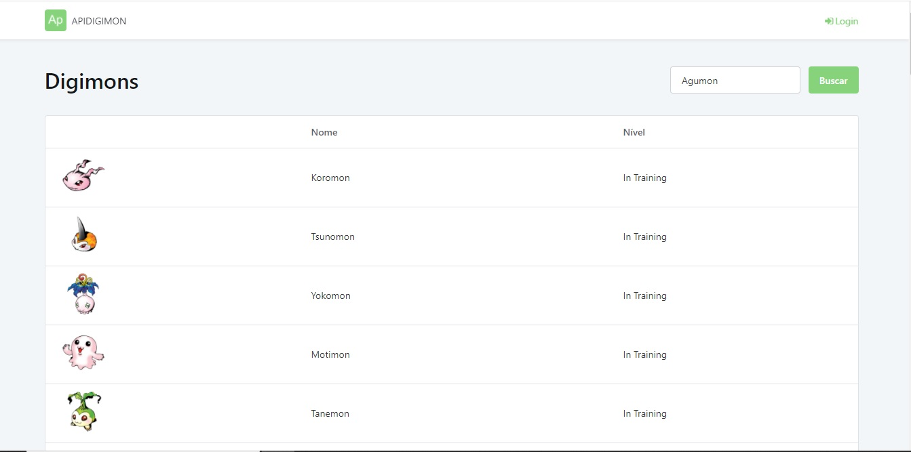
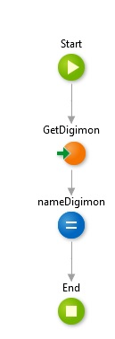

 

  </a

### 📃 Sobre o Projeto

Projeto outsystems para consumo de API.
- [x] API REST 
- [x] Uso da [API DIGIMON](https://digimon-api.herokuapp.com/)
- [x] Buscar todos os registros (Concluido) / Buscar apenas um registro (Em construção)

### 📺 Prévia

### 🧪 Testes
Criação de Preparation

### ⚙️ Testando a Aplicação
Para acessar o projeto, basta clicar no link a seguir.
[Clique Aqui](https://personal-1s0rwutw.outsystemscloud.com/APIDIGIMON/)

Feito com 💛 por João Marcos

